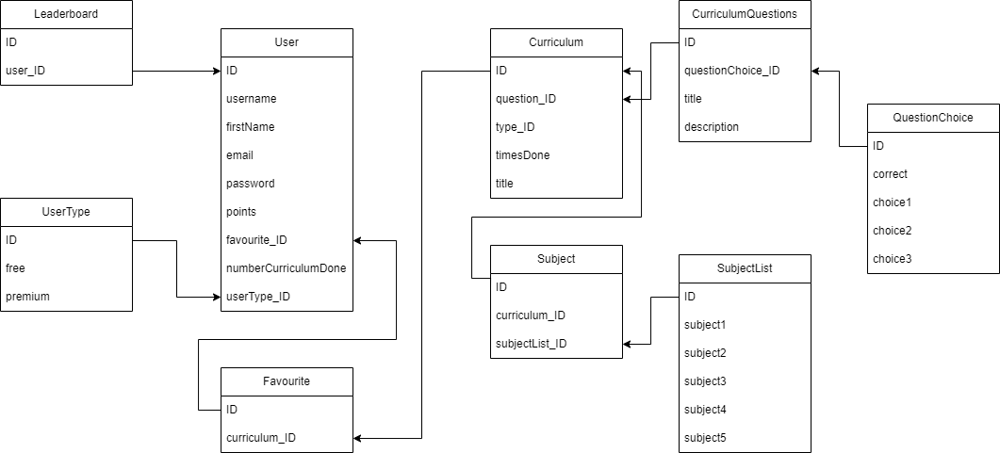

# Rendszerterv

## 3.1 A rendszer célja

A rendszer célja az, hogy a felhasználók különböző tesztek kitöltésével bővíthessék a tudásukat, versenyezhessenek egymással, vagy csak szimplán szórakoztató jellege miatt használhassák az alkalmazást. Az alkalmazás igényes, figyelemfelkeltő megjelenésével szeretnénk ösztönözni az embereket ennek használatára. A tesztek kitöltése után pontszámokat lehet gyűjteni, ezáltal elérhető egy bizonyos kompetencia a regisztrált felhasználók közt.

## 3.2 Projektterv

A projektet weblapon is valósítjuk meg, továbbá mobilos alkalmazás is tartozik a StudyUp projecthez. A mobilos alkalmazás mind a két fő platformot(Android, iOS) le fogja fedni. Ezen felületeknek van egyaránt frontend és backend része. Az egyes feladatokat többségében külön emberek végzik. A frontend fejlesztésére HTML-t és CSS-t alkalmazunk a webes felületen, míg az alkalmazásnál React Native-et használunk. A háttér adatokat a Firebase-ben kerülnek eltárolásban.

  - A frontend fejlesztők célja hogy egy könnyen átlátható, igényes, felhasználóbarát felületet hozzanak létre.
  - A backend fejlesztők feladata, a háttérben zajló folyamatok leprogramozása, JavaScript kód megírása, a program helyes működésének biztosítása, és az eredmény     kiértékelése.

## 3.3 Üzleti folyamatok modellje

## 3.4 Követelmények

A weboldal létrehozásához HTML/CSS illetve JavaScriptet használtunk. Továbbá a JavaScript-et React keretrendszerben használjuk. A felépítés és dizájnolás HTML és CSS implementálásával történik. Az oldal teljes értékű felhasználására elegendő egy egyszerű internetes böngészőt indítanunk. Az alkalmazások react Native-ben kerülnek megírásra.

## 3.5 Funkcionális terv Rendszerszereplők:

- Admin:Be tud jelentkezni és ki tud jelentkezni. Modosítani a teszteket. felhasználói adatbázishoz hozzá férni. Saját adatokat módosítani. Ranglista megtekinteni.
- Felhasználó: Betud jelentkezni. Továbbá teszteket tud kitölteni. Előtud fizetni. Ranglistát tud nézni. Sajátadatokat módosítani.
- Vendég: Regisztrálni tud.

## 3.6 Fizikai környezet

Az alkalmazás működik webes felületen, illetve Androidon és iOS-en is. Az igénybevételéhez szükség van regisztrációhoz, anélkül nincs lehetőség a tesztek megtekintésére és kitöltésére.

- Van tűzfal a hálózaton, és minden portot engedélyez.
- Nincsenek megvásárolt komponenseink
- Fejlesztői eszközök:
  - React Native
  - Visual Studio Code
  - Firebase
  - Figma

## 3.7 Adatbázis terv

## 3.8 Tesztterv
A teszt elsődleges célja: az eddig meglévő funkcióknak a különböző böngészőkkel való kompatibilitásának tesztelése.
 - Metódusok megfelelően működnek-e.
 - Különböző böngészőkkel való tesztelés (Edge, Google Chrome).
 - Android illetve IOS operációsrendszeren való tesztelés.
 
## 3.9 Telepítési terv

Android-ra és IOS-re készül a telefonos alkalmazás. Viszont webböngészőből is elérhető lesz, így telepítése nem feltétlen szükséges.

## 3.10 Implementációs terv

A Webes felület főként HTML, CSS, és Javascript nyelven fog készülni. A Javasriptet a React Native keretrendszeren belül használjuk. Ezeket a technológiákat amennyire csak lehet külön fájlokba írva készítjük, és úgy fogjuk egymáshoz csatolni a jobb átláthatóság érdekében. 
Az Android valamint az IOS alkalmazás a React Native keretrendszerrel készül.

## 3.11 Karbantartási terv

- A weboldal frissítési jogát fenntartjuk.
- Az oldal helyes működésének heti rendszerességgel történő ellenőrzése.
